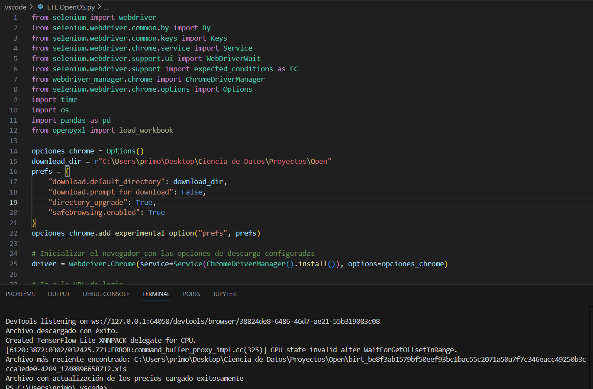

# 🔑 Locksmith - Price Update Automation Process

## 📌 Project Overview  
This project aims to automate the **file downloading** and **price updating** process for a locksmith shop, using **Python**. The current manual process involves logging into the supplier's website, downloading an Excel file, and then updating prices in the main file using VLOOKUP. This project automates the entire process to save time and increase efficiency.

The project was developed using the **Selenium** library for file download automation and **Pandas** for updating prices in the Excel file while preserving the original format.

## 🗂 Project Structure  
- **Python Script:** [`etl_script.py`](etl_script.py)  
- **Excel File:** [`prices_data.xlsx`](prices_data.xlsx)   

## 🔧 Tools & Technologies  
- **Python** (Selenium, Pandas)  
- **Excel**  
- **Selenium WebDriver** (for file download automation)

## 📊 Process and Results  
The ETL process in this project involves four main steps:
1. **Extraction:** Using Selenium to automate the file download from the supplier’s website.
2. **Check for Updates:** Verifying whether the prices have been updated. If the prices have changed, the script will proceed with the transformation. If the prices are the same, a message is displayed indicating that no updates are needed.
3. **Transformation:** Updating the prices in the Excel file using Pandas while keeping the original file structure.
4. **Loading:** The updated file is saved with the new prices for use in the sales process.

### Results:
- The process now runs automatically, eliminating the need for manual intervention.
- Updated prices are loaded into the file without losing the original format.

## 📊 Project Preview  

---

# 🔑 Cerrajería - Automación del Proceso de Carga de Precios

## 📌 Descripción del Proyecto  
Este proyecto tiene como objetivo automatizar el proceso de **descarga de archivos** y **actualización de precios** para una cerrajería, utilizando **Python**. El proceso manual actual implica acceder al sitio web del proveedor, iniciar sesión, descargar un archivo Excel y luego actualizar los precios en el archivo principal mediante VLOOKUP. Este proyecto automatiza todo el proceso para ahorrar tiempo y mejorar la eficiencia.

El proyecto se desarrolló utilizando la biblioteca **Selenium** para la automatización de la descarga del archivo y **Pandas** para la actualización de los precios en el archivo Excel, manteniendo el formato original.

## 🗂 Estructura del Proyecto  
- **Script de Python:** [`etl_script.py`](etl_script.py)  
- **Archivo Excel:** [`prices_data.xlsx`](prices_data.xlsx)  

## 🔧 Herramientas y Tecnologías  
- **Python** (Selenium, Pandas)  
- **Excel**  
- **Selenium WebDriver** (para la automatización de la descarga de archivos)

## 📊 Proceso y Resultados  
El proceso de ETL en este proyecto involucra cuatro pasos principales:
1. **Extracción:** Uso de Selenium para automatizar la descarga del archivo de precios desde el sitio web del proveedor.
2. **Chequeo de Actualización:** Verificación de si los precios han sido actualizados. Si los precios han cambiado, el script procederá con la transformación. Si los precios son los mismos, se muestra un mensaje indicando que no es necesario realizar actualizaciones.
3. **Transformación:** Actualización de los precios en el archivo Excel utilizando Pandas, manteniendo la estructura del archivo original.
4. **Carga:** El archivo actualizado se guarda con los nuevos precios para su uso en el proceso de ventas.

### Resultados:
- El proceso ahora se ejecuta automáticamente, eliminando la necesidad de intervención manual.
- Los precios actualizados se cargan en el archivo sin perder el formato original.

## 📊 Vista Previa del Proyecto  
 
